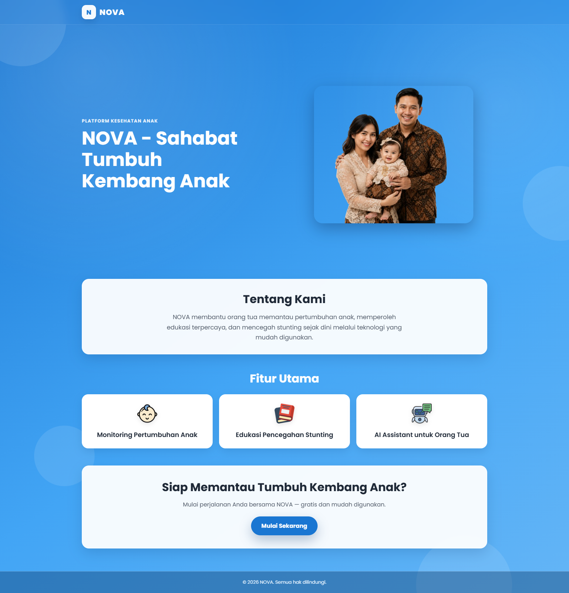
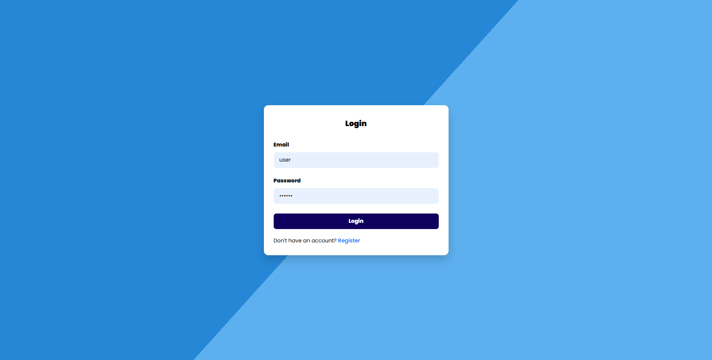
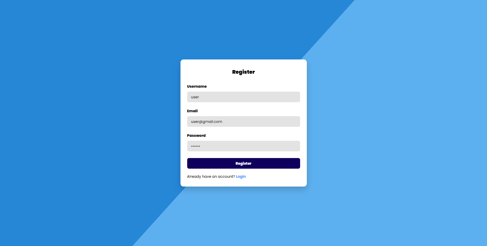
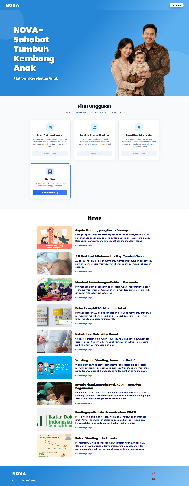
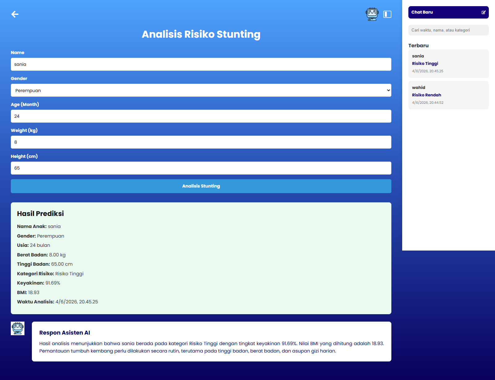

# NOVA - Nutrition Optimization for Vitality & Advancement

> Sahabat Tumbuh Kembang Anak

## Table of Contents

* [Description](#description)
* [Problem Statement](#problem-statement)
* [Features](#features)
* [System Architecture](#system-architecture)
* [Technologies](#technologies)
* [Project Structure](#project-structure)
* [Usage](#usage)
* [Screenshots](#screenshots)
* [Live Demo](#live-demo)
* [Repository](#repository)
* [Contributors](#contributors)
* [Future Improvements](#future-improvements)

---

## Description

NOVA (Nutrition Optimization for Vitality & Advancement) is an AI-powered web platform designed to assist parents in monitoring child growth and identifying potential stunting risks at an early stage.

The platform combines modern web technologies with machine learning to provide fast and accessible stunting risk predictions based on child growth data. In addition, NOVA offers educational content to help parents better understand nutrition, growth, and child development.

Developed as a Coding Camp Capstone Project, NOVA aims to contribute to the prevention of stunting through digital innovation and data-driven decision making.

---

## Problem Statement

Stunting remains one of the most significant child health challenges in Indonesia. Many parents struggle to recognize early indicators of growth problems, resulting in delayed intervention and treatment.

NOVA addresses this issue by providing:

* Early stunting risk detection using Artificial Intelligence
* Growth monitoring support
* Personalized recommendations based on prediction results
* Educational resources related to child nutrition and development

---

## Features

### Authentication

* User Registration
* User Login
* Secure Logout

### AI-Based Stunting Prediction

* Input child growth data
* AI-powered risk prediction
* Prediction result visualization
* Recommendation generation

### Dashboard

* Centralized user dashboard
* Access to prediction history
* Growth monitoring overview

### Educational Articles

* Nutrition awareness content
* Child development education
* Stunting prevention information

### Prediction History

* View previous prediction records
* Track past analyses and results

---

## System Architecture

```text
User
   │
   ▼
Frontend (React + Vite)
   │
   ▼
Backend API (Express.js)
   │
   ▼
Hugging Face Space
(XGBoost Model)
   │
   ▼
Prediction Result
   │
   ▼
PostgreSQL Database (Supabase)
   │
   ▼
Frontend Dashboard
```

---

## Technologies

### Frontend

* React.js
* Vite
* JavaScript
* CSS

### Backend

* Node.js
* Express.js
* REST API

### Database

* PostgreSQL
* Supabase

### Artificial Intelligence

* Python
* XGBoost
* Scikit-Learn
* Hugging Face Spaces

### Deployment

* Vercel
* Supabase
* Hugging Face Spaces

---

## Project Structure

```text
NOVA-project-capstone
│
├── docs/
│   ├── dashboard.png
│   ├── login.png
│   ├── register.png
│   ├── welcome_page.png
│   └── Novition.png
│
├── mecine-learning-ai/
│   ├── api/
│   ├── artifacts/
│   ├── dataset/
│   ├── models/
│   ├── notebooks/
│   ├── deployment/
│   └── stunting_deployment/
│
├── web-development/
│   ├── Backend/
│   └── Frontend/
│
└── README.md
```

### Folder Description

#### docs

Contains project documentation, architecture decisions, API contracts, database schema, screenshots, and technical references.

#### mecine-learning-ai

Contains machine learning datasets, notebooks, trained models, deployment files, and AI prediction services.

#### web-development/Frontend

React-based frontend application that provides the user interface and user experience.

#### web-development/Backend

Express.js backend application responsible for authentication, API services, prediction processing, and database integration.

---

## Usage

### 1. Access the Application

Open the deployed application:

https://nova-stunt.vercel.app/

### 2. Register an Account

Create a new account using the registration page.

### 3. Login

Sign in using your registered credentials.

### 4. Predict Stunting Risk

1. Navigate to the prediction page.
2. Enter child growth information.
3. Submit the form.
4. Wait for AI processing.
5. Receive prediction results and recommendations.

### 5. View Prediction History

Access historical prediction records from the dashboard.

### 6. Read Educational Articles

Browse educational content regarding nutrition, child growth, and stunting prevention.

---

## Screenshots

### Welcome Page



### Login Page



### Register Page



### Dashboard



### Stunting Prediction



---

## Live Demo

https://nova-stunt.vercel.app/

---

## Repository

https://github.com/GilangRaditya/NOVA-project-capstone

---

## Contributors

| Name                           | Participant ID |
| ------------------------------ | -------------- |
| Muhammad Naufal Ammr Dzakwan   | CACC875D6Y0538 |
| Jihan Aqilah                   | CDCC875D6X2665 |
| Gilang Raditya Ramahdani       | CFCC674D6Y2271 |
| Zaskia Anugrah Halimatusa'diah | CFCC674D6X0670 |
| Dalila Tazkia                  | CDCC875D6X2666 |
| Nabilah 'Adawiyyah             | CACC674D6X0565 |

---

## Future Improvements

Potential future enhancements include:

* Child growth visualization charts
* Nutrition recommendation engine
* AI consultation chatbot
* Mobile application version
* Multi-child profile management
* Enhanced machine learning models
* Personalized nutrition planning

---

## License

This project was developed as part of the Coding Camp Capstone Project Program.

All rights belong to the NOVA development team and respective contributors.
